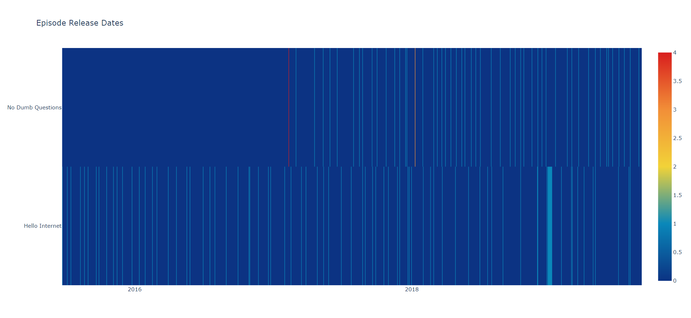

<h1>Podcasts Comparison</h1>

A python script that reads RSS feeds for two podcasts, makes a list of 
the release dates, and generates a heatmap of those release dates. 

Heatmap generated using Plotly: https://plot.ly/python/heatmaps/
